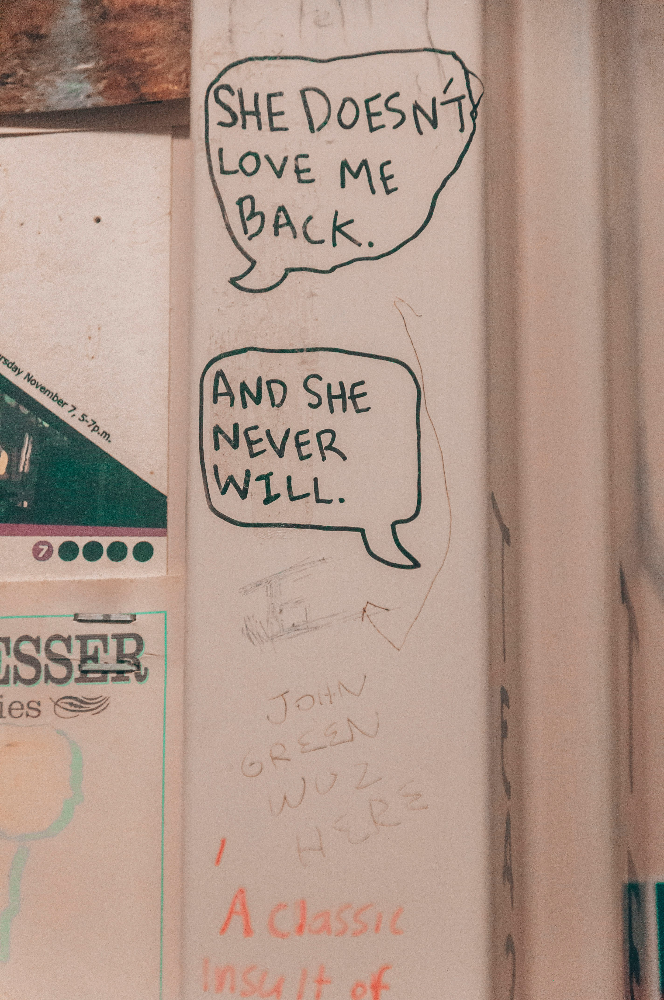

# Extração de Texto de Imagens com Azure Cognitive Services

Este repositório demonstra o uso do serviço de "Leitura" (parte do Computer Vision) do Azure Cognitive Services para extrair texto de imagens. O objetivo é explorar as capacidades do OCR da Azure em diferentes cenários, incluindo texto impresso, manuscrito, com diferentes fontes, tamanhos e em imagens com diferentes qualidades.

## Imagens de Entrada

A pasta `inputs` contém as imagens utilizadas para teste. Abaixo, uma breve descrição de cada imagem:

*   **`i-1.jpg`:** Imagem contendo código de programação (JavaScript ofuscado). 
    
*   **`i-2.jpg`:** Imagem de livros antigos.
    
*   **`i-3.jpg`:**  Imagem de um letreiro luminoso com a frase "ALL YOU NEED IS LOVE & MOJITOS".
    
*   **`i-4.jpg`:**  Imagem de uma pilha de livros, com diferentes tamanhos, fontes e orientações de texto.
    
*   **`i-5.jpg`:** Imagem contendo texto manuscrito.
    


## Resultados da Extração

Os resultados da extração de texto são salvos em arquivos `.txt` na pasta `output`, correspondendo a cada imagem de entrada.

*   **`i-1.txt`:**
    ```
    (ck?"\n"+V
    ctions(t){if(t)
    1.promise&&p.splice(r,!!!
    oid0,[t[m])}}catch(t){c(n,''/
    =r.writable&&r.configurable&&Object.og!
    e){n.call(r.t,e)}).then(t,e)},t[R]=!0}var-W
    &t.rejection;e?console.error("UnhandledPromiser
    lue:",e,einstanceofError?e.stack:void0):console
    ;try{t.zone.runGuarded(function(){throwt})}catch
    =null,k=!0,w!1,S0,T=function(){vart=!1;return
    ="object",P="function",M_h("currentTask"),Dh("
    wnewError("MustbeaninstanceofPromise.");nly
    ZoneAwarePromise(){[nativecode]}"},t.resolve
    =function(t){functione(t){a&&(a=r(t))}functionn
    ,cu.next();!c.done;cu.next()){varsc.value;o(
    Ali(u)}finally{if(f)throwf.error}returna;var
    c.done:cu.next()){varsc.value;o(s)||
    1avfc&!c.done&&(1=u.return)&l.c
    Le.current;returnthis[y]
    xx.reject,x.race
    II(L&&dele)
    ```
*   **`i-2.txt`:**
    ```
    (WE.COX)
    ```
*   **`i-3.txt`:**
    ```
    (ALL
    YOU
    NEED
    IS
    LOVE)
    ```
*   **`i-4.txt`:**
    ```
    (ZEROTOONE
    PETERTHIEL
    Virgin
    EGOISTHEENEMY
    RYAN
    HOLIDAY
    RYAN
    THEOBSTACLEISTHEWAY
    HOLIDAY
    TheTimelessArtofTurningTrialsintoTriumph
    PORTFOLIO
    EXPONENTIALORGANIZATIONS
    ISMAIL,MALONE
    &VANGEEST
    DIVERSION
    BOOKS
    Competing
    THESTORYofINNOVATION
    ClaytonM.Christensen
    AgainstLuck
    andCUSTOMERCHOICE
    TaddyHall,KarenDillon,
    1817
    BUSINESS
    andDavidS.Duncan
    HARPER
    ValuePropositionDesign
    THESTARTUP
    OWNER'SMANUAL
    WILEY
    SteveBlank
    BobDorf
    Thecorporatestartup
    TendayıVını
    DanToma
    EstherGons)
    ```
*   **`i-5.txt`:**
    ```
    (SHEDOESN'T
    LOVEME
    BACK.
    sdayNovember7,5-7p.m.
    ANDSHE
    NEVER
    WILL.
    7
    ISSER
    les
    JOHN
    GREEN
    WOZ
    1
    HERE
    Aclassic
    Insultof)
    ```

## Processo

O processo de extração seguiu os seguintes passos:

1.  **Configuração do ambiente:**
    *   Criação de uma conta no Azure e obtenção das credenciais (chave de assinatura e endpoint) do serviço Computer Vision.
    *   Instalação da biblioteca `azure-cognitiveservices-vision-computervision`: `pip install azure-cognitiveservices-vision-computervision`
2.  **Desenvolvimento do script Python:**
    *   Implementação do código para ler as imagens da pasta `inputs`, enviar para a API de Leitura do Azure e salvar os resultados na pasta `output`. (Código abaixo)
3.  **Execução do script:**
    *   Execução do script Python para processar as imagens.

## Código Python

```python
from azure.cognitiveservices.vision.computervision import ComputerVisionClient
from azure.cognitiveservices.vision.computervision.models import OperationStatusCodes
from msrest.authentication import CognitiveServicesCredentials
import time
import os

# Substitua pelas suas credenciais
SUBSCRIPTION_KEY = "SUA_CHAVE_DE_ASSINATURA"
ENDPOINT = "SEU_ENDPOINT"

from azure.cognitiveservices.vision.computervision import ComputerVisionClient
from azure.cognitiveservices.vision.computervision.models import OperationStatusCodes
from msrest.authentication import CognitiveServicesCredentials
import time
import os

# Substitua pelas suas credenciais
SUBSCRIPTION_KEY = "SUA_CHAVE_DE_ASSINATURA"
ENDPOINT = "SEU_ENDPOINT"

computervision_client = ComputerVisionClient(ENDPOINT, CognitiveServicesCredentials(SUBSCRIPTION_KEY))

# Pasta de entrada e saída
input_folder = "inputs"
output_folder = "output"

# Cria a pasta de saída se ela não existir
os.makedirs(output_folder, exist_ok=True)

for filename in os.listdir(input_folder):
    if filename.endswith((".jpg", ".jpeg", ".png", ".bmp")): # Verifica se é um arquivo de imagem
        filepath = os.path.join(input_folder, filename)
        
        with open(filepath, "rb") as image_stream:
            read_response = computervision_client.read(image_stream, raw=True)

        read_operation_location = read_response.headers["Operation-Location"]
        operation_id = read_operation_location.split("/")[-1]

        while True:
            read_result = computervision_client.get_read_result(operation_id)
            if read_result.status not in ["notStarted", "running"]:
                break
            time.sleep(1)

        output_filename = os.path.splitext(filename)[0] + ".txt"
        output_filepath = os.path.join(output_folder, output_filename)

        with open(output_filepath, "w", encoding="utf-8") as outfile:
            if read_result.status == OperationStatusCodes.succeeded:
                for text_result in read_result.analyze_result.read_results:
                    for line in text_result.lines:
                        outfile.write(line.text + "\n")
            else:
                outfile.write("Erro na extração de texto.")

        print(f"Texto extraído de {filename} e salvo em {output_filename}")
```


# Extração de Texto de Imagens com Azure

Este repositório demonstra como usar o serviço de "Extract text from images" do Azure para extrair texto de imagens.

## Imagens de Entrada


## Processo

O código Python utiliza a biblioteca `azure-cognitiveservices-vision-computervision` para interagir com a API do Azure. O script lê arquivos de imagem da pasta `inputs`, extrai o texto usando o Azure e salva os resultados em arquivos `.txt` na pasta `output`.

## Insights e aprendizados:


* Desempenho com texto denso e complexo: A imagem possui uma grande quantidade de texto em um espaço relativamente pequeno, o que testa a capacidade do OCR de distinguir caracteres próximos e evitar erros de leitura.

* Reconhecimento de caracteres especiais e símbolos: O código contém diversos caracteres especiais como (, ), {, }, [, ], =, !, ?, +, -, /, *, ;, :, &, |, etc. Testar com essa imagem avalia a precisão do OCR no reconhecimento desses símbolos, que são cruciais em código de programação.

* Lidando com formatação e indentação: Embora a imagem não preserve a indentação original do código, ela ainda apresenta diferentes níveis de "recuo" visual devido à forma como o código foi disposto na imagem. Isso pode influenciar na forma como o OCR interpreta as linhas e a ordem dos caracteres.

* Robustez a artefatos de imagem: Dependendo da qualidade da imagem, podem existir artefatos de compressão, ruído ou outros problemas que dificultam a leitura. Testar com essa imagem ajuda a entender a robustez do OCR a esses problemas.

* Diferença entre texto e código: A imagem contém texto "normal" (como as mensagens de erro "Unhandled Promise Rejection") misturado com código. Isso permite avaliar se o OCR consegue diferenciar esses contextos.

* Potencial para análise de código: Embora o serviço de extração de texto do Azure não realize diretamente a análise de código, a extração precisa do texto é o primeiro passo para isso. Com o texto extraído, você poderia usar outras ferramentas para análise sintática, desofuscação ou outras tarefas relacionadas a código.


